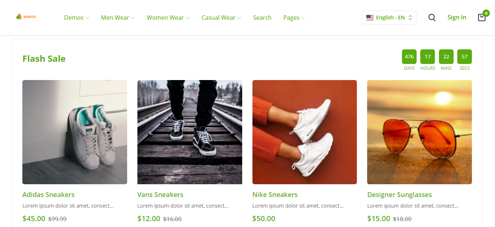
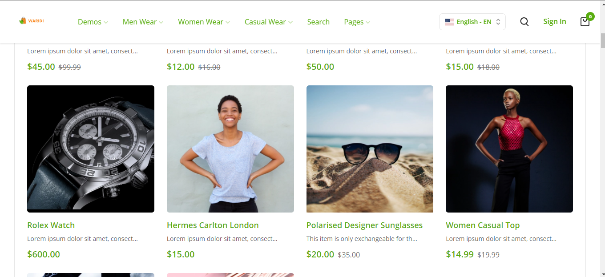
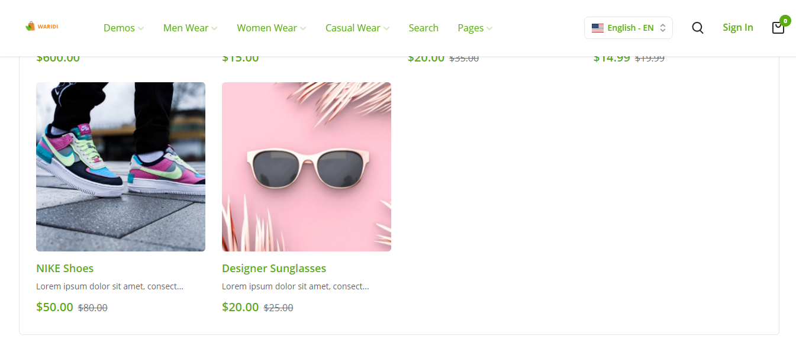
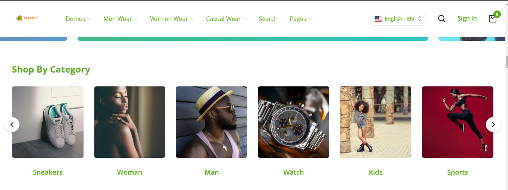
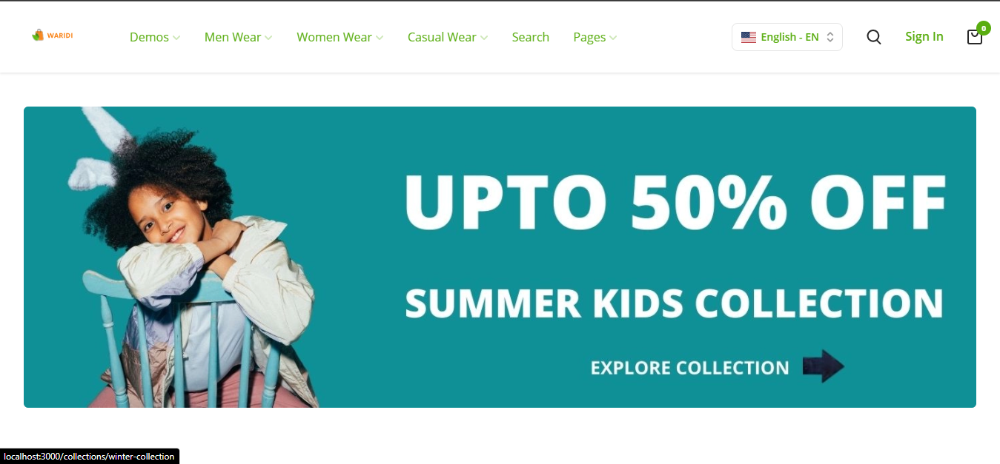
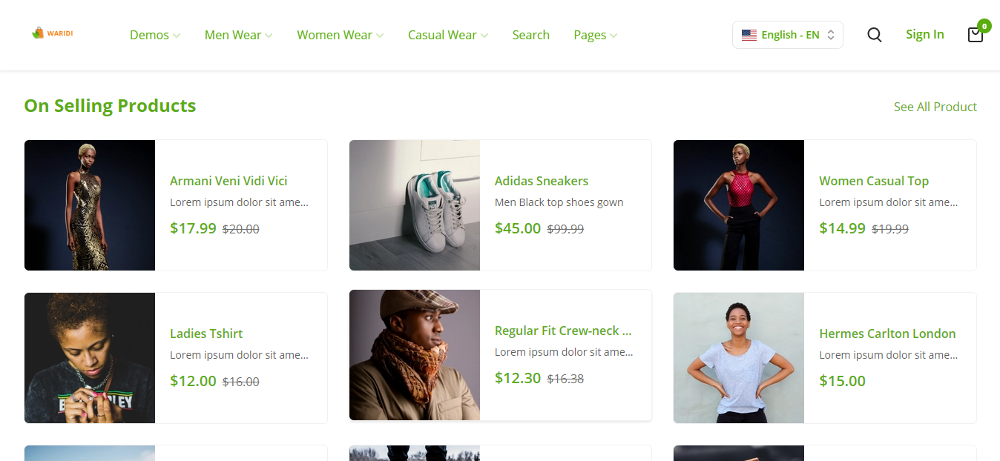
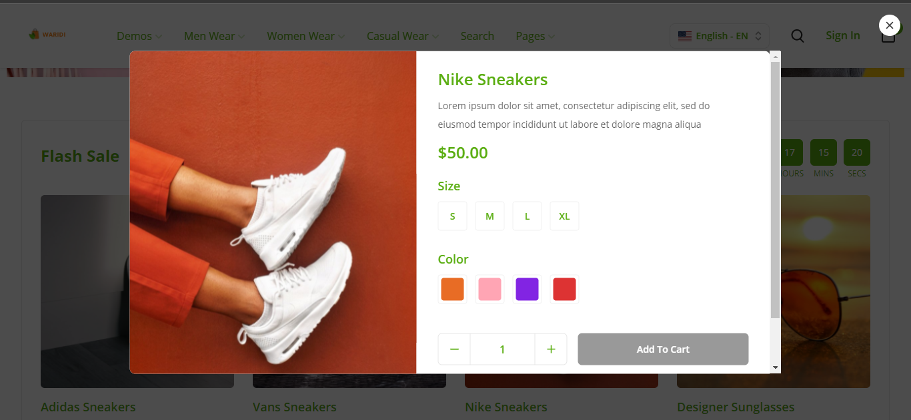
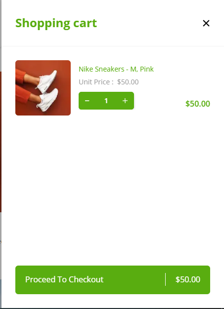

# Waridi Documentation

## Introduction

An ecommerce Platform built with `React`, `NextJS`, `TypeScript`, `React-Query` and `Tailwind CSS`. Implemented data fetching by using `react-query`.

## Requirements

- node(12.13.0 or later)
- yarn(version 1)
- editor: Visual Studio Code(recommended)

## Technologies used

- [React](https://reactjs.org/)
- [NextJs](https://nextjs.org/)
- [TypeScript](https://www.typescriptlang.org/)
- [React Query](https://react-query.tanstack.com/)
- [Axios](https://axios-http.com/)
- [Tailwind CSS](https://tailwindcss.com/)

## Getting Started & Installation

### Development Environment

Clone  this repo here unzip it and run the following command:

```bash
$ yarn
$ yarn dev 
```

### Step 2 : Running the project

Run below command for getting started with this project.

```bash

$ yarn
$ yarn dev
```

### Production Environment

```bash

yarn build

yarn start
```


















